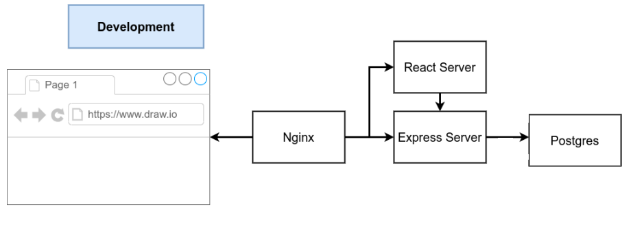

Do zbudowania tej aplikacji zostal uzyty przyklad z dodatkowych materialow do laboratorium 11.

W porownianiu do oryginalu wyeliminowany zostal kontener worker wraz z konterem redis.

Wszelkie obliczenia zostaly wykonane w serverze express, a ich wynik zapisany w bazie danych PostgreSQL.

Poprawione zostalo mapowanie portu dla nginx w pliku docker-compose.dev.yml.

Logika kliencka i serwerowa zostala zmodyfikowana i dopasowana do tresci zadania.

#Architektura

