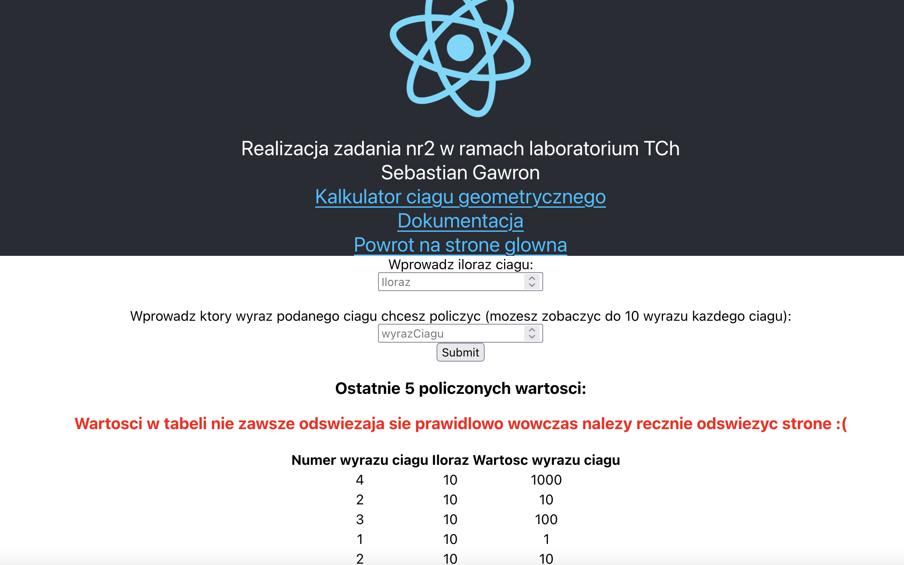

# Dev

W celu zbudowania ponizszych aplikacji uzylem nastepujacych polecen:

## Aplikacja frontentdowa

**Upewnij sie ze znajdujesz sie w katalogu zadanie2/client!**

``
docker build -f Dockerfile.dev -t zadanie2:frontend_dev .
``

## Nginx

**Upewnij sie ze znajdujesz sie w katalogu zadanie2/nginx!**

``
docker build -f Dockerfile.dev -t zadanie2:nginx_dev .
``

## Aplikacja backendowa

**Upewnij sie ze znajdujesz sie w katalogu zadanie2/server!**

``
docker build -f Dockerfile.dev -t zadanie2:backend_dev .
``

## Docker compose

W celu prostego i szybkiego uruchomienia aplikacji nalezy skorzystac z pliku docker-compose
**Upewnij sie ze znajdujesz sie w katalogu zadanie2!**

``
docker compose -f docker-compose.dev.yml up
``

## Dzialanie aplikacji

